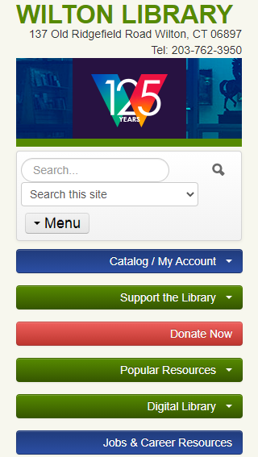
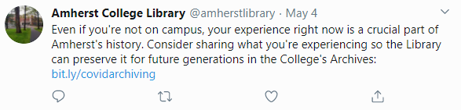

# Case Study: Thoughts on Library Website Designs
This is a small exploration of common UI practices in library website designs.

- **The search interface on a library website should provide options for searching the catalog, the website itself, and a clear differentiation between the two.**
-- Example: The New York Public Library has a search interface that seems to work well.
-- Clicking the prominent “search” button expands a simple keyword search bar with radio buttons for selecting to search either the catalog or the website. The accompanying text, “what would you like to find?” emulates in-person library reference interactions. The two radio buttons provide a clear division between catalog searches and website searches.
-- 
-- Further thoughts: Some library websites do not clearly show the division of catalog/website searches, which can cause confusion for users if they accidentally search the website when they mean to search the catalog. This could be solved by looking at use cases and performing task analyses. An essential user case could be to check out a book on a particular subject, and the system responsibility for each step of user intention should be to make the process as clear as possible.

- **Website design principles call for simplicity, speed of use, and awareness of the audience. For libraries, it is important to find a balance between showcasing all of its services, and not creating clutter.**
-- Essential services should be made as clear as possible; a FAQ can be helpful for basic information on using library services. If a website is too overloaded with text and colors it will be difficult for users to locate information.
-- 
-- Further thoughts: Task analysis and user cases would help with this. Spending time organizing the information architecture of the website could inform a more natural design, which would be helpful for users. Libraries could also use web analytics to analyze how users are accessing their site and inform design decisions.

- **The library website should work on all size screens, and the catalog needs to be responsive and clear to use on mobile devices.**
-- I noticed that in many library websites, the catalog was difficult to use on mobile, even if the main website was fine. I do not know enough about how catalogs are integrated into libary websites, but it is something I wanted to point out.
-- It is also important to make sure the website works well with common text-to-speech software and other accessibility programs. It would be helpful to develop personas that use these when gathering requirements and conducting usability testing. The same user cases and task analyses that are performed on the main website should also be performed on a mobile device.
-- Further thoughts: Touchscreens afford a larger variety of actions, and the website should respond according to the user’s expectations. A navigational bar affords tapping, and a carousel affords side-swiping; it might be expensive to hire a web designer who can ensure that these functions work, but libraries with less resources can at least test the website for nonresponsive elements.
-   

- **Offer different mailing lists.**
-- Something I saw fairly often (mostly in smaller libraries) is that there is only one mailing list. Not every user in the community wants a giant weekly newsletter about children's programs, and if they unsubscribe then they'll miss the notification for the yearly plant sale. Even if it is only once a month, separate mailing lists for different types of programming can be really helpful for outreach.
-- Further thoughts: The HCI lingo here is "external cognition" but I wasn't totally sure how to incorporate it into the paragraph.

- **Social media can be really helpful. It can used to better understand users in the community. It can be used to ask for donations or input on programming. It can offer reminders about events.**
-- A lot of libraries lack social media pages. They can be a pain, but they are a great tool for interacting with the community. Like the above statement, it just might be difficult to find a balance between promoting outreach and not being annoying.
-- 

- **A chat reference service can be helpful for users, but it is important to train staff on how to properly communicate in this format.**
-- Of the six libraries I surveyed, only one provided a virtual reference chat. This fits the mental model users have of going to the library and receiving reference instruction. Unfortunately, the online format affords more breakdowns in communication than would normally occur in person, due to a lack of nonverbal communication cues in the online format.
-- Further thoughts: From personal experience, many users of these services often need technology assistance, so it might be helpful to involve staff with more knowledge in that area.

